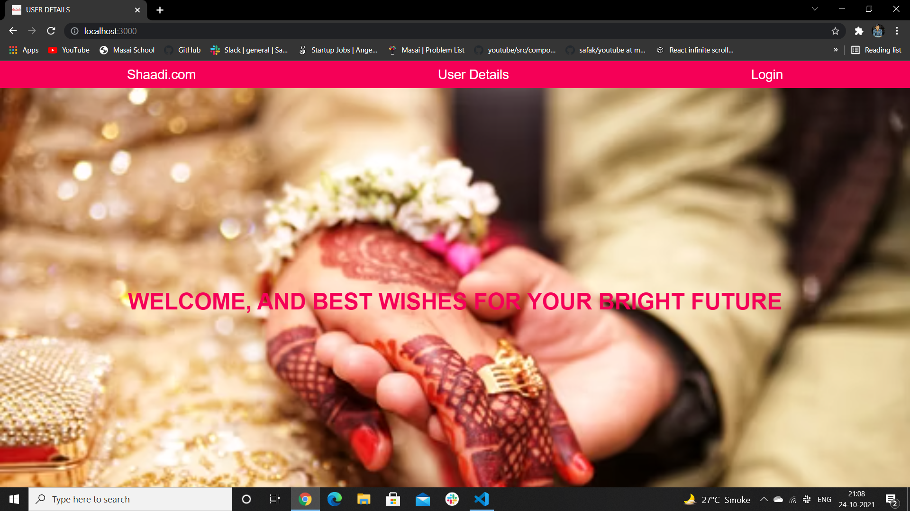
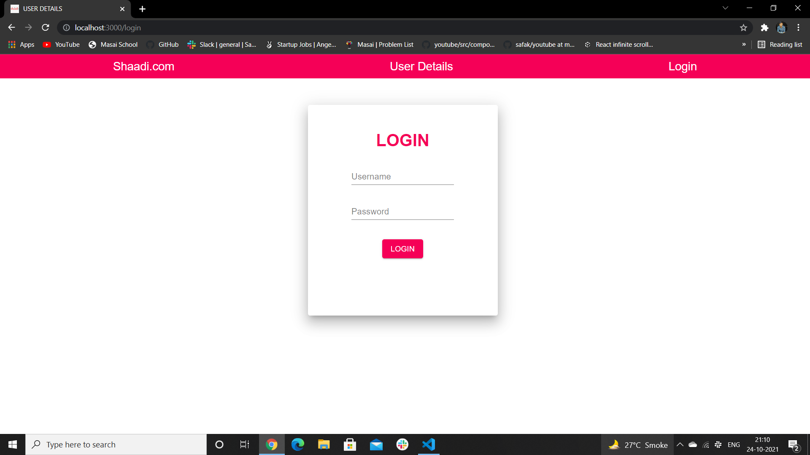

# shadi-user
React Application

# Landing page

# Login page

# User Details page

# Githut link
<a href="https://github.com/Harshsanas/shadi-user.git">https://github.com/Harshsanas/shadi-user.git</a>

# To start application with live server
npm i => npm start

